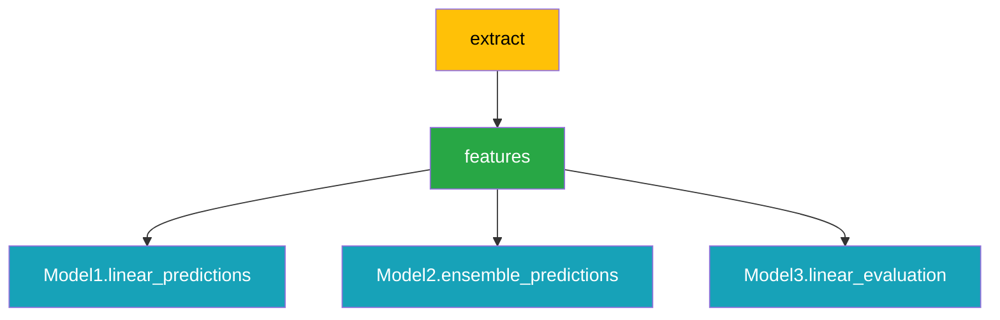
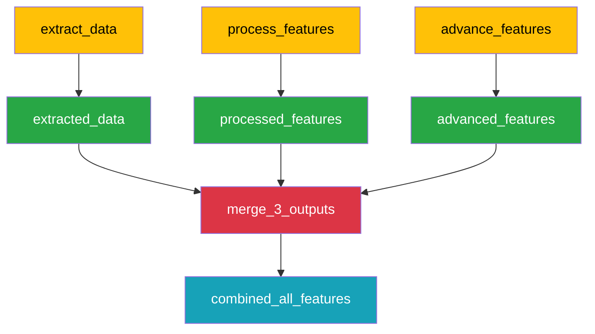
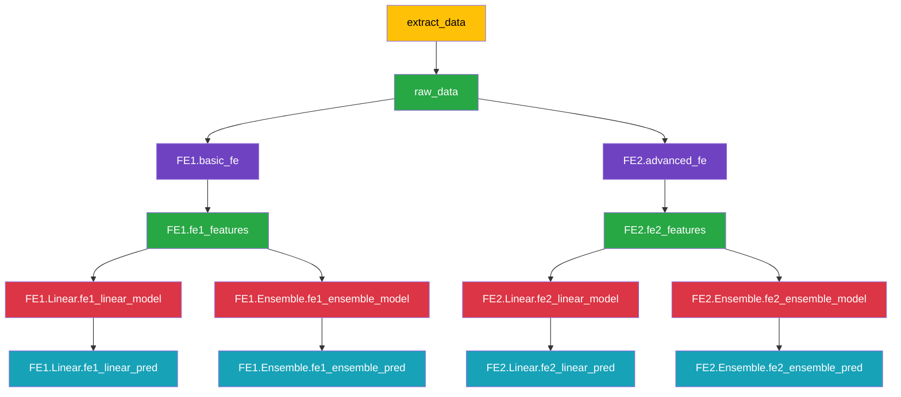

# RPC - Kedro Compose Patterns

Code example notebook: [Notebook Link](examples/patterns_demo.ipynb)
## 1. Simple Branching Pattern

One parent pipeline branches into multiple child pipelines with automatic connections.

## 2. Merge Pattern

Multiple separate pipelines that converge into a single combined result using `.merge()` functionality.

## 3. Nested Tree / Cartesian Product

Create all combinations of feature engineering approaches × modeling approaches.

---

## Pattern Reference Table

| Pattern                             | Description                                                         | Code Example                                                                                                                                                                                                                           | Diagram                                        |
| ----------------------------------- | ------------------------------------------------------------------- | -------------------------------------------------------------------------------------------------------------------------------------------------------------------------------------------------------------------------------------- | ---------------------------------------------- |
| **Simple Branching**                | One parent branches to multiple children with automatic connections | `parent = ComposablePipeline(data_prep_pipeline)` `parent.add_child("Model1", model1_pipeline)` `parent.add_child("Model2", model2_pipeline)` `parent.add_child("Model3", model3_pipeline)`                                   | [Pattern 1](#1-simple-branching-pattern)       |
| **Merge Pattern**                   | Multiple separate pipelines converge using merge functionality      | `branch = ComposablePipeline(pipeline)` `merged = branch.merge(` `    func=combine_features,` `    outputs="combined_all_features")`                                                                                          | [Pattern 2](#2-merge-pattern)                  |
| **Nested Tree / Cartesian Product** | Cartesian product: FE approaches × Model approaches                 | `for fe_name, fe_pipeline in fe_approaches.items():` `    fe_branch = root.add_child(fe_name, fe_pipeline)` `    for model_name, model_pipeline in models.items():` `        fe_branch.add_child(model_name, model_pipeline)` | [Pattern 3](#3-nested-tree--cartesian-product) |

## Key Features

- 🚀 **Automatic Connections**: Parent outputs automatically connect to matching child inputs
- 🏗️ **Namespace Management**: Hierarchical namespaces generated automatically
- 🔗 **Merge Functionality**: Built-in `.merge()` method for fan-in patterns
- 📊 **Visualization**: ASCII pipeline visualization with `draw_pipeline()`
- 🔄 **Recursive Building**: Handles multi-level nested structures seamlessly